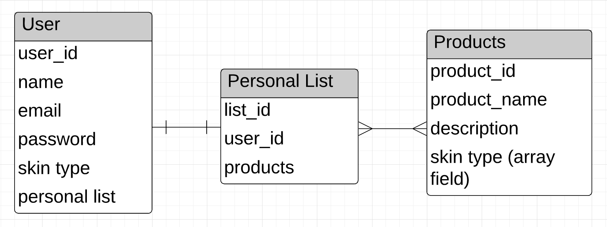

# Simply Happy Skin

Simply Happy Skin is an online platform where you can build your own skincare routine based on the selected skin type you have

To visit website <a href="https://simplyhappyskin.herokuapp.com/">click here. </a>

## Scope

The minimum viable product(MVP) of this project is for users to sign up/log in and view different products based on the skin type that best suits them. Then, users will be able to add products to their personal list in their account

## Wireframes 

## Data Models/Entity Relationship Diagram (ERD) 

